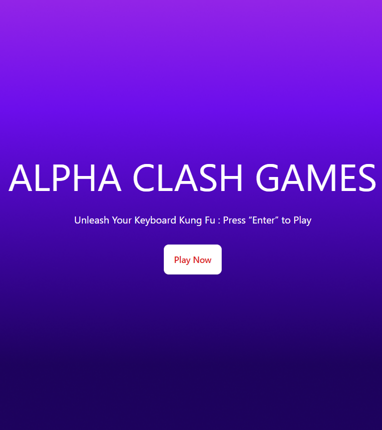
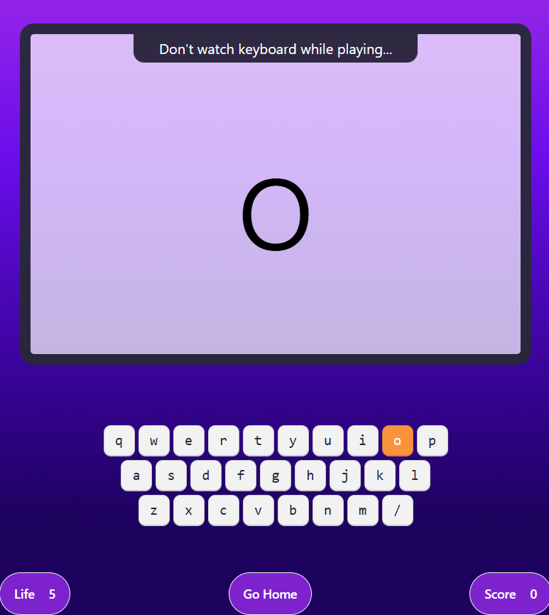

# 🎮 Alpha Clash Game – Alphabet Typing Challenge

This is a responsive web-based typing game designed to improve typing accuracy and speed. The game presents a random alphabet, and users must type it correctly. It supports both desktop and mobile devices (including external keyboards and touch inputs) with vibration feedback on supported Android browsers.

[🔗 Live Demo](https://devo-ab.github.io/alpha-clash-games)

---

## 🛠️ Tech Stack

- **HTML5**
- **CSS3**
- **Tailwind CSS**
- **DaisyUI**
- **JavaScript (DOM + Event handling + Logic)**
---

## 🌟 Features

- 🖥️ Two pages: Welcome screen and game playground
- 🔤 Random alphabet shown each round
- ✅ Correct input = +1 score
- ❌ Wrong input = -1 life (Max 5 lives)
- 🎮 Supports:
  - Physical keyboard
  - Mobile touch input
  - External keyboard (mobile/desktop)
- 📳 Android vibration support (Chrome, Edge, Firefox)
- 📱 Fully responsive for all screen sizes 

---

---

## 📁 Folder Structure

```
alpha-clash-games/
├── assets/
│   ├── images/             # images files
│   ├── logo/               # logo files
├── css/                    # Custom CSS
├── preview/                # Screenshots for README
├── script/                 # JavaScript for area calculations
├── index.html              # Main landing page
└── README.md               # Project documentation
└── tailwind.config.js      # Tailwind config
```

---

## 🖼️ Screenshots

### Home Page




### Playground



---

## 📲 How to Use Locally

1. **Clone the repo**
   ```bash
   git clone https://github.com/devo-ab/alpha-clash-games.git
   cd alpha-clash-games
   ```

# 👤 Author

# Avi Jit

## :mailbox: Reach me out

<p align="left">
<a href="https://linkedin.com/in/itsavijitb" target="blank"></a>
<a href="https://twitter.com/itsavijitb" target="blank"></a>
<a href="https://facebook.com/itsavijitb" target="blank"></a>
<a href="https://instagram.com/itsavijitb" target="blank"></a>
</p>
